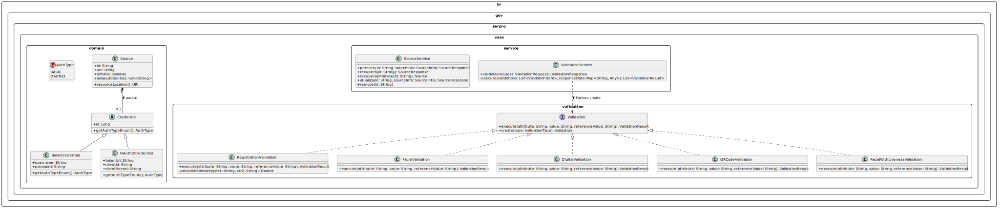
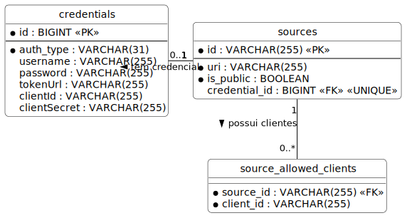

# Arquitetura e Modelagem

Abaixo está o diagrama de classes detalhado contendo a relação entre as Validações, Fontes de Dados e Autenticadores pertinentes ao projeto:

*(O código-fonte PlantUML deste diagrama pode ser consultado e alterado em [diagrams/class_diagram.puml](diagrams/class_diagram.puml))*

## Modelo de Dados e Relacionamento

Para garantir suporte para ACL e flexibilidade de Autenticadores a aplicação se baseia na persistência das informações nas seguintes entidades relacionais:

*(O código-fonte PlantUML deste diagrama pode ser consultado e alterado em [diagrams/erd_diagram.puml](diagrams/erd_diagram.puml))*
